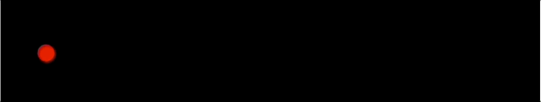

# Else If and Else Statements

In our previous lesson, we learned how to construct conditional statements that ran blocks of code only *if* a given condition were true. Today we will be adding more complexity by adding `else if` and `else` statements to our original `if` statements.

Suppose you want to tell someone to wear a coat if the temperature is below 50 degrees, otherwise you want to tell them they don't need a jacket. An `else` statement is a statement that we can add to our `if` statement. If the condition (or conditions) we are testing are `false`, then the else statement will run.

```javascript
if(temperature < 40)
{
	// Code to run if true
	console.log("Wear a jacket!");
}
else 
{
	// Code to run if false
	console.log("No jacket needed today!");
}
```

In addition to `else` statements, we can construct `else if` statements. These follow our original `if` statement. An `else if` block will run **ONLY** if the original if statement is false. **NOTE**: You can have as many else if statements as you want!

```javascript
var grade = 85
if(grade >= 90)
{
	// Code to run if true
	console.log("You got an A!");
}
else if(grade >= 80)
{
	// Code to run if false
	console.log("You got a B!");
}
else {
	console.log("Keep trying to get your grade up!")
}
```

## Lab
For today's lab, you will be creating a series of if/else if/else statements to produce the images shown below.

**CHALLENGE #1**: Draw a square in the middle of the screen when the mouse is to the left of the center of the screen. Draw a circle in the middle of the screen when the mouse is to the right of the center of the screen. 


**CHALLENGE #2**: Draw a square in the middle of the screen when the mouse is to the top of the center of the screen. Draw a circle in the bottom of the screen when the mouse is to the right of the center of the screen. 


**CHALLENGE #3**: Draw a circle if the `mouseX` is at a given coordinate. For example, if the `mouseX` is at 100, draw the circle at x value of 100. If the `mouseX` is at 200 draw the ellipse at x = 200. You should continue this logic for the entire width of the screen.



**CHALLENGE #4**: Draw a circle on the screen as the cursor moves to the right. Circles should appear about every 100 units on the x axis. For example, draw the first circle only if the `mouseX` is larger than 100, the second if the `mouseX` is larger than 200, etc.


**CHALLENGE #5**: Use conditionals to program a traffic light that changes colors according to the position of your mouse. **Only one ellipse can light up at a time.**


**STRETCH**: Restructure the code you drew above, but the green light should only turn on when the mouse is clicked. You will need to research how to do this on the p5 documentation!

**DOUBLE TRIPLE BONUS STRETCH**: Turn on the red light when you type the letter "r", the yellow light when you type the letter "y", and the green light when you type the letter "g". Research the `keyPressed` and `keyTyped` functions on p5!
